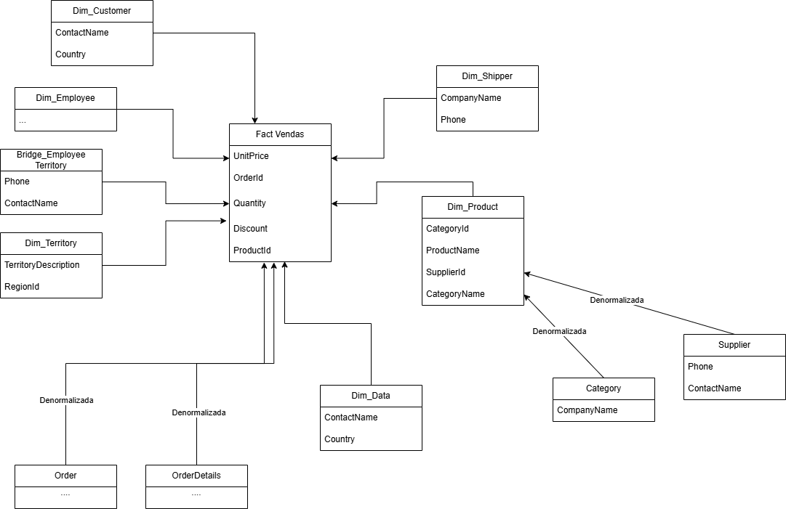

   ## Modelagem Dimensional utilizando dbt

 Este projeto contém uma modelagem dimensional, para o dataset **Northwind**, que visa responder perguntas de negócio.

 O Warehouse foi modelado utilizando o star schema de Kimball, visualmente representado a seguir.
 

Stakeholder 1 — Marcus Chen, CEO

Contexto: Marcus lidera uma distribuidora global e precisa de visão estratégica consolidada. Ele consome dashboards, não escreve queries.

US-01 — Visão de Receita Líquida
"Como CEO, quero acompanhar a receita total (faturamento bruto menos descontos) ao longo do tempo, para entender se o negócio está crescendo e identificar sazonalidades."

Resposta: [US1](assets/US1.jpg)

US-02 — Performance por Mercado (Países)
"Como CEO, quero ver quais países geram mais receita, para priorizar onde investir em expansão ou onde agir para reverter queda em mercados específicos."

Resposta: [US2](assets/US2.jpg)

US-03 — Clientes Estratégicos
"Como CEO, quero identificar meus maiores clientes por valor total gerado em vendas, para garantir que estamos priorizando o relacionamento com quem mais impacta o faturamento."

Resposta: [US3](assets/US3.jpg)

US-04 — Pontualidade de Entrega (SLA)
"Como CEO, quero saber se estamos enviando os pedidos antes ou na data limite estipulada, para avaliar se problemas logísticos estão afetando a experiência do cliente."

Resposta: [US4](assets/US4.jpg)

US-05 — Performance por Categoria
"Como CEO, quero entender quais categorias de produto sustentam nossa margem de receita, para embasar decisões de portfólio e negociações de volume."

Resposta: [US5](assets/US5.jpg)

Stakeholder 2 — Ana Souza, Analista de BI

Contexto: Ana dá suporte ao Marcus e às áreas comercial e de operações. Ela escreve SQL, constrói relatórios e precisa de dados granulares para descer do nível macro até o detalhe.

US-06 — Análise de Mix de Produtos
"Como Analista de BI, quero visualizar o ranking de produtos por quantidade vendida e receita líquida, identificando itens 'curva A' e produtos com baixo giro de estoque."

Resposta: [US6](assets/US6.jpg)

US-07 — Frequência de Recompra (Retenção)
"Como Analista de BI, quero analisar o intervalo médio de dias entre pedidos por cliente, para identificar padrões de retenção e sinalizar contas que pararam de comprar."

Resposta: [US7](assets/US7.jpg)

US-08 — Performance e Concentração de Fornecedores
"Como Analista de BI, quero analisar quais fornecedores entregam os produtos com maior volume de vendas, para identificar dependências críticas de fornecimento."

Resposta: [US8](assets/US8.jpg)

US-09 — Eficiência Logística por Transportadora
"Como Analista de BI, quero comparar o tempo médio de envio (ShippedDate - OrderDate) entre as transportadoras, para identificar gargalos operacionais e apoiar renovações de contrato."

Resposta: [US9](assets/US9.jpg)

US-10 — Performance da Equipe de Vendas
"Como Analista de BI, quero acompanhar o volume de pedidos e receita gerada por cada funcionário, cruzando com seus respectivos territórios para entender a cobertura de mercado."

Resposta: [US10](assets/US10.jpg)
Obs: Existem tooltips, indicando cobertura de mercado(respectivo territorio)

**Você pode acessar o .pibix [aqui](resources/Northwind.pbix).